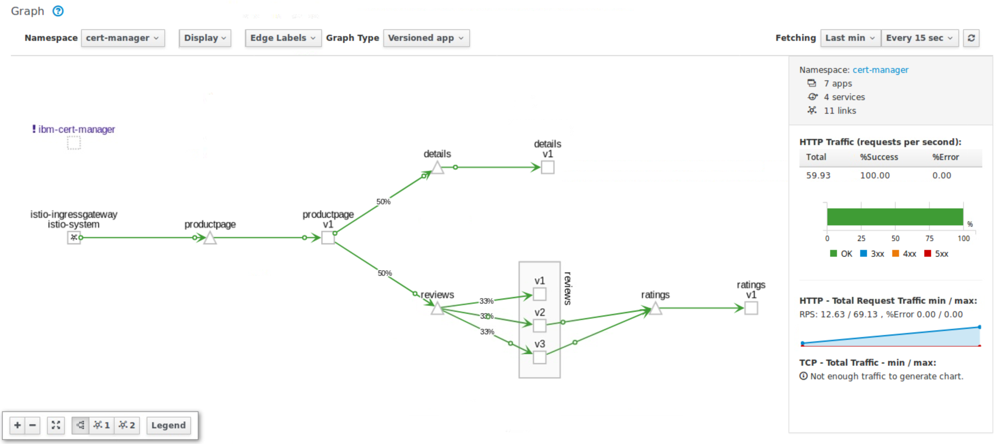
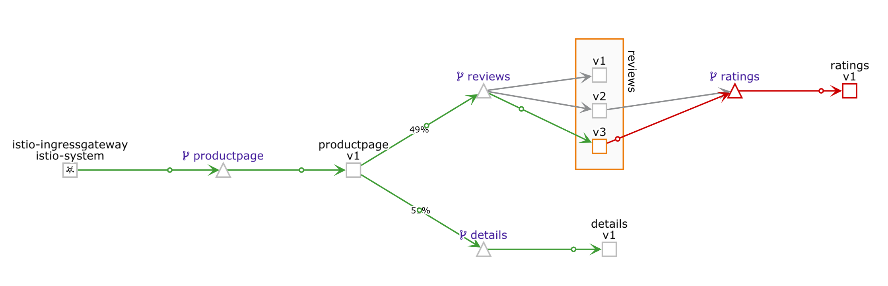
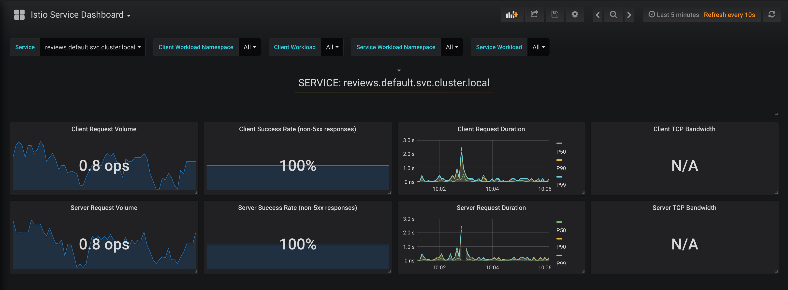

# Introduction to Istio - Part A
## Traffic Management for your Microservices


Microservices and containers changed application design and deployment patterns, but along with them brought challenges like service discovery, routing, failure handling, and visibility to microservices. "Service mesh" architecture was born to handle these features. Applications are getting decoupled internally as microservices, and the responsibility of maintaining coupling between these microservices is passed to the service mesh.

[Istio](https://istio.io/), a joint collaboration between IBM, Google and Lyft provides an easy way to create a service mesh that will manage many of these complex tasks automatically, without the need to modify the microservices themselves. Istio does this by:

1. Deploying a **control plane** that manages the overall network infrastructure and enforces the policy and traffic rules defined by the devops team

2. Deploying a **data plane** which includes “sidecars”, secondary containers that sit along side of each instance of a microservice and act as a proxy to intercept all incoming and outgoing network traffic. Sidecars are implemented using Envoy, an open source edge proxy

Once Istio is installed some of the key feature which it makes available include

- Traffic management using **Istio Pilot**: In addition to providing content and policy based load balancing and routing, Pilot also maintains a canonical representation of services in the mesh.

- Access control using **Istio Auth**: Istio Auth secures the service-to-service communication and also provides a key management system to manage keys and certificates.

- Monitoring, reporting and quota management using **Istio Mixer**: Istio Mixer provides in depth monitoring and logs data collection for microservices, as well as collection of request traces. Precondition checking like whether the service consumer is on whitelist, quota management like rate limits etc. are also configured using Mixer.

In the [first part](#part-a-deploy-sample-bookinfo-application-and-inject-istio-sidecars-to-enable-traffic-flow-management-access-policy-and-monitoring-data-aggregation-for-application) of this journey we show how we can deploy the sample [BookInfo](https://istio.io/docs/samples/bookinfo.html) application and inject sidecars to get the Istio features mentioned above, and walk through the key ones. The BookInfo is a simple application that is composed of four microservices, written in different languages for each of its microservices namely Python, Java, Ruby, and Node.js. The application does not use a database, and stores everything in local filesystem.

Also since Istio tightly controls traffic routing to provide above mentioned benefits, it introduces some drawbacks. Outgoing traffic to external services outside the Istio data plane can only be enabled by specialized configuration, based on the protocol used to connect to the external service.

In the [second part](#part-b-modify-sample-application-to-use-an-external-datasource-deploy-the-application-and-istio-envoys-with-egress-traffic-enabled) of the journey we focus on how Istio can be configured to allow applications to connect to external services. For that we modify the sample BookInfo application to use an external database and then use it as a base to show Istio configuration for enabling egress traffic.


## Included Components
- [Istio](https://istio.io/)
- [Kiali](https://www.kiali.io/)
- [Grafana](http://docs.grafana.org/guides/getting_started)
- [Jaeger](https://www.jaegertracing.io/)
- [Prometheus](https://prometheus.io/)
- [IBM Cloud Kubernetes Service](https://console.ng.bluemix.net/docs/containers/cs_ov.html#cs_ov)
- [Continuous Delivery Service](https://console.ng.bluemix.net/catalog/services/continuous-delivery)

# Prerequisites
Get a Kubernetes cluster...

- [Minikube](https://kubernetes.io/docs/getting-started-guides/minikube) for local testing 
- [IBM Cloud Private](https://github.com/IBM/deploy-ibm-cloud-private/blob/master/README.md)
- [IBM Cloud Kubernetes Service](https://console.ng.bluemix.net/docs/containers/cs_ov.html#cs_ov) to deploy in cloud. 
- [IBM Cloud Private hosted trial](https://www.ibm.com/cloud/garage/dte/tutorial/ibm-cloud-private-hosted-trial) to deploy in cloud. 

The code here is regularly tested against IBM Cloud Kubernetes Service using Travis.

Create a working directory to clone this repo and to download Istio into:

```bash
cd
mkdir ibm
cd ibm
git clone https://github.com/IBM/traffic-management-for-your-microservices-using-istio.git demo
```

First we will delete the old version of ISTIO (0.7.1)


```bash
kubectl delete -f ~/istio-0.7.1/samples/bookinfo/kube/bookinfo.yaml -n default
kubectl delete -f ~/istio-0.7.1/install/kubernetes/istio.yaml
```

Then we will install the latest Istio service mesh (1.0.5 as of this writing) on top of your Kubernetes cluster.

Here are the steps:


```bash
cd
wget https://github.com/istio/istio/releases/download/1.0.5/istio-1.0.5-linux.tar.gz
tar -xvzf ./istio-1.0.5-linux.tar.gz
mv istio-1.0.5 istio # replace with version downloaded
export PATH=$PWD/istio/bin:$PATH
```


```bash
kubectl create namespace istio-system
kubectl apply -f ~/istio/install/kubernetes/helm/istio/templates/crds.yaml
kubectl apply -f https://raw.githubusercontent.com/niklaushirt/microservices-traffic-management-using-istio/master/istio.yaml
```


# Steps

### Part A: Deploy sample Bookinfo

Deploy sample Bookinfo application and inject Istio sidecars to enable traffic flow management, access policy and monitoring data aggregation for application
application and inject Istio sidecars to enable traffic flow management, access policy and monitoring data aggregation for application

1. [Deploy sample BookInfo application with Istio sidecar injected](#1-deploy-sample-bookinfo-application-with-istio-sidecar-injected)
2. [Configure Traffic flow](#2-traffic-flow-management-using-istio-pilot---modify-service-routes)
3. [Configure access control](#3-access-policy-enforcement-using-istio-mixer---configure-access-control)
4. [Collect metrics, logs and trace spans](#4-telemetry-data-aggregation-using-istio-mixer---collect-metrics-logs-and-trace-spans)
     - 4.1 [Collect metrics and logs using Prometheus and Grafana](#41-collect-metrics-and-logs-using-prometheus-and-grafana)
     - 4.2 [Collect request traces using Jaeger](#42-collect-request-traces-using-jaeger)

### Part B: Modify sample application 

Modify sample application to use an external datasource, deploy the application and Istio envoys with egress traffic enabled

5. [Create an external datasource for the application](./README_PART_2.md#5-create-an-external-datasource-for-the-application)
6. [Modify sample application to use the external database](./README_PART_2.md#6-modify-sample-application-to-use-the-external-database)
7. [Deploy application microservices and Istio envoys with egress traffic enabled](./README_PART_2.md#7-deploy-application-microservices-and-istio-envoys-with-egress-traffic-enabled)

## Part A: Deploy sample Bookinfo application

## 1. Deploy sample BookInfo application with Istio sidecar injected

In this part, we will be using the sample BookInfo Application that comes as default with Istio code base. As mentioned above, the application that is composed of four microservices, written in different languages for each of its microservices namely Python, Java, Ruby, and Node.js. The default application doesn't use a database and all the microservices store their data in the local file system.
Envoys are deployed as sidecars on each microservice. Injecting Envoy into your microservice means that the Envoy sidecar would manage the ingoing and outgoing calls for the service. To inject an Envoy sidecar to an existing microservice configuration, do:

```bash
kubectl apply -f <(istioctl kube-inject -f ~/istio/samples/bookinfo/platform/kube/bookinfo.yaml) -n default
```

> `istioctl kube-inject` modifies the yaml file passed in _-f_. This injects Envoy sidecar into your Kubernetes resource configuration. The only resources updated are Job, DaemonSet, ReplicaSet, and Deployment. Other resources in the YAML file configuration will be left unmodified.

After a few minutes, you should now have your Kubernetes Pods running and have an Envoy sidecar in each of them alongside the microservice. The microservices are **productpage, details, ratings, and reviews**. Note that you'll have three versions of the reviews microservice.


```
kubectl get pods


NAME                                        READY     STATUS    RESTARTS   AGE
details-v1-1520924117-48z17                 2/2       Running   0          6m
productpage-v1-560495357-jk1lz              2/2       Running   0          6m
ratings-v1-734492171-rnr5l                  2/2       Running   0          6m
reviews-v1-874083890-f0qf0                  2/2       Running   0          6m
reviews-v2-1343845940-b34q5                 2/2       Running   0          6m
reviews-v3-1813607990-8ch52                 2/2       Running   0          6m
```

Create an Istio ingress gateway to access your services over a public IP address.

```bash
kubectl apply -f  ~/istio/samples/bookinfo/networking/bookinfo-gateway.yaml -n default
```


Now you can access your application via: [`http://10.0.0.1:31380/productpage`](http://10.0.0.1:31380/productpage) (replace 10.0.0.1 with the address of your cluster)

If you refresh the page multiple times, you'll see that the _reviews_ section of the page changes. That's because there are 3 versions of **reviews**_(reviews-v1, reviews-v2, reviews-v3)_ deployment for our **reviews** service. Istio’s load-balancer is using a round-robin algorithm to iterate through the 3 instances of this service

##### V1 - No ratings


##### V2 - Ratings with black stars


##### V3- Ratings with red stars


## Monitoring with Kiali
You can open Kiali via [`http://10.0.0.1:31119/`](http://10.0.0.1:31119/) (replace 10.0.0.1 with the address of your cluster)


1. Select `Graph` in the left hand menu.
1. Then select `cert-manager` from the Namespaces drop-down menu
1. Make sure that you check all types from the `Display` drop-down menu
1. And `Requests percent of total` from the `Edge Labels` drop-down menu

You can then observe traffic flowing through your mesh network.



In order to create some more sustained traffic, open a new tab in the Terminal and paste the following code

```bash
watch -n 1 curl -s http://$(hostname --ip-address):31380/productpage
```


Get more info on the [Kiali](https://www.kiali.io/documentation/overview/) website.

## 2. Traffic flow management using Istio Pilot - Modify service routes

In this section, Istio will be configured to dynamically modify the network traffic between some of the components of our application. In this case we have 2 versions of the “reviews” component (v1 and v2) but we don’t want to replace review-v1 with review-v2 immediately. In most cases, when components are upgraded it’s useful to deploy the new version but only have a small subset of network traffic routed to it so that it can be tested before the old version is removed. This is often referred to as “canary testing”.

There are multiple ways in which we can control this routing. It can be based on which user or type of device that is accessing it, or a certain percentage of the traffic can be configured to flow to one version.

This step shows you how to configure where you want your service requests to go based on weights and HTTP Headers. You would need to be in the root directory of the Istio release you have downloaded on the Prerequisites section.

#### 1. Destination Rules

Before moving on, we have to define the destination rules. The destination rules tell Istio what versions (subsets in Istio terminology) are available for routing. This step is required before fine-grained traffic shaping is possible.

```bash
kubectl apply -f ~/istio/samples/bookinfo/networking/destination-rule-all.yaml -n default


destinationrule.networking.istio.io/productpage created
destinationrule.networking.istio.io/reviews created
destinationrule.networking.istio.io/ratings created
destinationrule.networking.istio.io/details created
```

For more details, see the [Istio documentation](https://istio.io/docs/tasks/traffic-management/traffic-shifting/).

#### 2. Set Default Routes to `reviews-v1` for all microservices  

This would set all incoming routes on the services (indicated in the line `destination: <service>`) to the deployment with a tag `version: v1`. To set the default routes, run:

  ```bash
  kubectl apply -f ~/istio/samples/bookinfo/networking/virtual-service-all-v1.yaml -n default
  ```

#### 3. Set Route to `reviews-v2` of **reviews microservice** for a specific user  

This would set the route for the user `jason` (You can login as _jason_ with any password in your deploy web application) to see the `version: v2` of the reviews microservice. Run:

  ```bash
  kubectl apply -f ~/istio/samples/bookinfo/networking/virtual-service-reviews-test-v2.yaml -n default
  ```

#### 4. Route 50% of traffic on **reviews microservice** to `reviews-v1` and 50% to `reviews-v3`.  

This is indicated by the `weight: 50` in the yaml file.

  > Using `replace` should allow you to edit existing route-rules.

  ```bash
  kubectl apply -f ~/istio/samples/bookinfo/networking/virtual-service-reviews-50-v3.yaml -n default
  ```

#### 5. Route 100% of the traffic to the `version: v3` of the **reviews microservices**  

This will direct all incoming traffic to version v3 of the reviews microservice. Run:

  ```bash
  kubectl apply -f ~/istio/samples/bookinfo/networking/virtual-service-reviews-v3.yaml -n default
  ```

## 3. Access policy enforcement using Istio Mixer - Configure access control

This step shows you how to control access to your services. It helps to reset the routing rules to ensure that we are starting with a known configuration. The following commands will first set all review requests to v1, and then apply a rule to route requests from user _jason_ to v2, while all others go to v3:

```bash
   kubectl apply -f ~/istio/samples/bookinfo/networking/virtual-service-all-v1.yaml -n default
   kubectl apply -f ~/istio/samples/bookinfo/networking/virtual-service-reviews-jason-v2-v3.yaml -n default
```

You'll now see that your `productpage` always red stars on the reviews section if not logged in, and always shows black stars when logged in as _jason_.

* To deny access to the ratings service for all traffic coming from `reviews-v3`, you will use apply these rules:

  ```bash
   kubectl apply -f ~/istio/samples/bookinfo/policy/mixer-rule-deny-label.yaml -n default
   kubectl apply -f ~/istio/samples/bookinfo/policy/mixer-rule-ratings-denial.yaml
  ```

* To verify if your rule has been enforced, point your browser to your BookInfo Applicatio. You'll notice you see no stars from the reviews section unless you are logged in as _jason_, in which case you'll see black stars.


And in Kiali you should see the following:




## Cleanup 

Now let's clean up the mess and get back to a nice simple state.

```bash
kubectl delete -f ~/istio/samples/bookinfo/policy/mixer-rule-deny-label.yaml -n default
kubectl delete -f ~/istio/samples/bookinfo/policy/mixer-rule-ratings-denial.yaml
kubectl delete -f ~/istio/samples/bookinfo/networking/virtual-service-all-v1.yaml -n default
kubectl delete -f ~/istio/samples/bookinfo/networking/virtual-service-reviews-jason-v2-v3.yaml -n default
kubectl apply -f ~/istio/samples/bookinfo/networking/destination-rule-all.yaml -n default
```


## 4. Telemetry data aggregation using Istio Mixer - Collect metrics, logs and trace spans

### 4.1 Collect metrics and logs using Prometheus and Grafana

This step shows you how to configure [Istio Mixer](https://istio.io/docs/concepts/policy-and-control/mixer.html) to gather telemetry for services in your cluster.


* Verify that the required Istio addons (Prometheus and Grafana) are available in your cluster:

  ```bash
  kubectl get pods -n istio-system | grep -E 'prometheus|grafana'
  
  grafana-6cbdcfb45-bwmtm                     1/1       Running     0          4d
  istio-grafana-post-install-h2dgz            0/1       Completed   1          4d
  prometheus-84bd4b9796-vnb58                 1/1       Running     0          4d
  ```

* Make sure you still send traffic to that service. You can renew the `watch` command from earlier.


* Point your browser to [`http://10.0.0.1:31118/`](http://10.0.0.1:31118) (replace 10.0.0.1 with the address of your cluster)


  Your dashboard should look like this:  
  
 
Play around and observer the different metrics being collected.

[Collecting Metrics and Logs on Istio](https://istio.io/docs/tasks/telemetry/metrics-logs.html)

### 4.2 Collect request traces using Jaeger

Jaeger is a distributed tracing tool that is available with Istio.

  Access the Jaeger dashboard at [`http://10.0.0.1:31117/`](http://10.0.0.1:31117) (replace 10.0.0.1 with the address of your cluster)

  Your dashboard should look something like this:
  
  

* Make sure you still send traffic to that service. You can renew the `watch` command from earlier.

* Go to your Jeger Dashboard again and you will see a number of traces done. Click on Find Traces button to see the recent traces (previous hour by default.)


* Click on one of those traces and you will see the details of the traffic you sent to your BookInfo App. It shows how much time it took for the request on `productpage` to finish. It also shows how much time it took for the requests on the `details`,`reviews`, and `ratings` services.


[Jaeger Tracing on Istio](https://istio.io/docs/tasks/telemetry/distributed-tracing/)


# Clean-up


* To delete the BookInfo app and its route-rules: ` ~/istio/samples/bookinfo/platform/kube/cleanup.sh`

* To delete Istio from your cluster

```bash
kubectl delete -f https://raw.githubusercontent.com/niklaushirt/microservices-traffic-management-using-istio/master/istio.yaml
kubectl delete -f ~/istio/install/kubernetes/helm/istio/templates/crds.yaml
kubectl delete ns istio-system

```

# References
[Istio.io](https://istio.io/docs/tasks/)
# License
This code pattern is licensed under the Apache Software License, Version 2.  Separate third party code objects invoked within this code pattern are licensed by their respective providers pursuant to their own separate licenses. Contributions are subject to the [Developer Certificate of Origin, Version 1.1 (DCO)](https://developercertificate.org/) and the [Apache Software License, Version 2](http://www.apache.org/licenses/LICENSE-2.0.txt).

[Apache Software License (ASL) FAQ](http://www.apache.org/foundation/license-faq.html#WhatDoesItMEAN)
